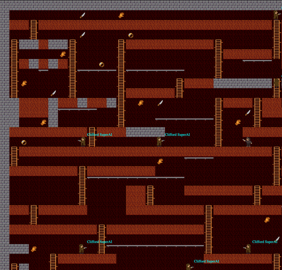

<meta charset="UTF-8">

## Вступление

Игровой demo-сервер доступен так же в интернете 24/7 в целях
ознакомления [http://codenjoy.com/codenjoy-contest](http://codenjoy.com/codenjoy-contest).

Игра с открытым исходным кодом. Для реализации своей игры, исправления
ошибок в текущей и внесения других правок необходимо для начала
[форкнуть проект](https://github.com/codenjoyme/codenjoy.git).
В корне репозитория есть описание в файле Readme.md - там описано, что делать дальше.

По возникающим вопросам, пиши в [skype alexander.baglay](skype:alexander.baglay)
или на почту [apofig@gmail.com](mailto:apofig@gmail.com).

## В чем суть игры?

Будь внимателен: во время игры тебе стоит сосредоточиться на реализации логики
передвижения и активности героя. Остальное - подключение по websocket, некоторое 
API для парсинга борды - уже реализовано для тебя.

Тебе необходимо написать своего бота для детектива, который 
обыграет детективов других игроков по очкам. Все играют на одном 
поле. Детектив может передвигаться по свободным ячейкам во все 
четыре стороны.

Детектив может вскарабкаться по лестнице (вверх/вниз), а 
так же передвигаться по трубе (влево/вправо). С трубы можно
спрыгнуть вниз. Детектив падает до тех пор, пока не приземлится. 
Падение с высоты безопасно для детектива.

На своем пути детектив может повстречать улики, врагов, 
других игроков, черные ходы и зелья.

Детектив так же должен быть внимателен, ведь на пути могут 
быть оставлены простреленные другими детективами ямы. Ямы со 
временем зарастают, но если в нее угодить и не успеть выбраться -
быть беде! Нет разницы в чью яму угодил детектив - попав в 
яму он побудет в ней некоторое время и замуруется, штрафные 
очки за смерть отнимутся и новый детектив появится в произвольном 
месте на поле. Если же под ямой есть пустота, лестница или 
труба - детектив проскочит сквозь яму не застряв.

Встав на клетку с уликой, игрок получает за неё очки, а улика, 
которую подобрал игрок, исчезает с карты. Каждый игровой тик 
на карте генерируется одинаковое количество улик разного типа - 
встречаются улики перчатка, нож и кольцо. Количество полученных 
за улики очков зависит от её типа.

По карте снуют враги - это воры, которые следят за жертвой,
и пытаются её догнать. Если злой бот настигает игрока, в этот 
момент его детектив отправляется в байтовый рай. Но не всё так 
страшно, уже в следующем игровом тике игрок получит респаун в 
рандомном месте на игровой карте.

Также, каждый игрок может прострелить ямку в разрушаемой стене 
(есть еще неразрушаемые). Ямка со временем зарастает. Так можно 
спастись от вора.

Штрафные очки так же предусмотрены за падение самого героя в 
свою или чужую ямку из которой он не сможет выбраться. Если ямка 
чужая - конкурент-участник получит очки.

Если простреленная ямка создает дыру в полу, то детектив может 
пролететь сквозь нее не застревая. Таким образом можно собирать 
улики "висящее" в воздухе.

Очки зарабатываются во время собирания улик и устранение 
конкурентов в ямках.

За каждую новую улику детектив получает немного больше очков, 
чем за предыдущую. Счетчик сбрасывается при потере героя - 
выгодно собирать улики и не терять героя. Очки суммируются. 
Побеждает игрок с большим числом очков (до условленного времени).

Однако, это ещё не всё, и ближе к финалу в игре припасено ещё 
несколько механик.

В частности, на карте могут появляться черные ходы. Запрыгивая 
в черный ход, в следующем тике игрок перемещается на место 
другого, рандомно выбранного черного хода (узнать заранее, в 
каком месте карты вы окажетесь нельзя). Черные ходы находятся 
на своих исходных местах в течение нескольких игровых тиков, 
затем меняют своё расположение случайным образом.

Также, ближе к финалу[*](index.md#ask), на карте начнут появляться 
специальные зелья... Игрок, подобрав такое зелье (встав на одну 
клетку с ним), на несколько игровых тиков становится под маскировкой. 
С этого момента ему становятся не страшны боты-воры. Оказавшись 
с ними на одной клетке, игрок просто пройдёт сквозь них. Встреча 
же с другим игроком может быть более коварной. Если игрок-маскировка 
встаёт на одну клетку с обычным игроком, маскировка убивает 
бедолагу. При этом, игрок-маскировка получает дополнительные 
очки, а ушедший в мир иной игрок может, напротив, потерять несколько 
очков (это мы решим ближе к финалу). В случае же, если на одной 
клетке встречаются две маскировки, обе остаются живы, при этом 
не теряют, но и не зарабатывают очков.

Очки суммируются. Побеждает игрок с большим числом очков (до условленного
времени).

[*](index.md#ask)Точное количество очков за любое действие на
данный момент игры уточни у Сенсея.

## Подключение к серверу

Итак, игрок [регистрируется на сервере](../../../register?gameName=clifford),
указывая свой email.

Далее необходимо подключиться из кода к серверу через websocket.
[Эта подборка](https://github.com/codenjoyme/codenjoy-clients.git)
клиентов для разных языков программирования тебе поможет в твоей игре.
Как запустить клиент смотри в корне проекта в файле README.md.

Если ты не можешь найти свой язык - придется написать свой клиент
(а после пошарить с нами на почту [apofig@gmail.com](mailto:apofig@gmail.com))

Адрес для подключения к игре на сервере выглядит так (ты можешь скопировать его
из игровой комнаты):

`https://[server]/codenjoy-contest/board/player/[user]?code=[code]`

Тут `[server]` - домен или ip-адрес игрового сервера, `[user]` - id игрока, a `[code]` -
твой security token. Убедись что код хранится в тайне, иначе любой участник
сможет играть от твоего имени.

## Формат сообщений

После подключения клиент будет регулярно (каждую секунду) получать строку
символов — с закодированным состоянием поля. Формат таков:

`^board=(.*)$`

C помощью этого regexp можно выкусить строку доски. 

## Пример поля

Вот пример строки от сервера:

<pre>board=☼☼☼☼☼☼☼☼☼☼☼☼☼☼☼☼☼☼☼☼☼☼☼☼☼☼☼☼☼☼☼          $                 ☼☼###########################H☼☼   $              $        H☼☼H☼☼#☼☼H    H#########H $   H☼☼H $   H    H         H#####H☼☼H#☼#☼#H    H         H      ☼☼H     H~~~~H~~~~~~   H      ☼☼H     H    H  $  H###☼☼☼☼☼☼H☼☼H     H $  H#####H         H☼☼☼###☼##☼##☼H         H###H##☼☼☼###☼      H         H   H  ☼☼☼$  ☼      H   ~~~}~~H   H $☼☼########H###☼☼☼☼     H  ####☼☼        H     $      H      ☼☼###########################H☼☼    $                      H☼☼#######H#######            H☼☼       H~~~~~~~~~~     $   H☼☼       H    ##H   #######H##☼☼       H    ##H          H  ☼☼##H#####    ########H#######☼☼  H     ►   $       H       ☼☼#########H##########H       ☼☼         H          H       ☼☼       $ H~~~~~~~~~~H   $   ☼☼    H######         #######H☼☼    H           $          H☼☼###########################H☼☼☼☼☼☼☼☼☼☼☼☼☼☼☼☼☼☼☼☼☼☼☼☼☼☼☼☼☼☼☼</pre>

Длинна строки равна площади поля `N*N`. Если вставить символ 
переноса строки каждые `N=sqrt(length(string))` символов, то 
получится читабельное изображение поля.

<pre>☼☼☼☼☼☼☼☼☼☼☼☼☼☼☼☼☼☼☼☼☼☼☼☼☼☼☼☼☼☼
☼          $                 ☼
☼###########################H☼
☼   $              $        H☼
☼H☼☼#☼☼H    H#########H $   H☼
☼H $   H    H         H#####H☼
☼H#☼#☼#H    H         H      ☼
☼H     H~~~~H~~~~~~   H      ☼
☼H     H    H  $  H###☼☼☼☼☼☼H☼
☼H     H $  H#####H         H☼
☼☼###☼##☼##☼H         H###H##☼
☼☼###☼      H         H   H  ☼
☼☼$  ☼      H   ~~~}~~H   H $☼
☼########H###☼☼☼☼     H  ####☼
☼        H     $      H      ☼
☼###########################H☼
☼    $                      H☼
☼#######H#######            H☼
☼       H~~~~~~~~~~     $   H☼
☼       H    ##H   #######H##☼
☼       H    ##H          H  ☼
☼##H#####    ########H#######☼
☼  H     ►   $       H       ☼
☼#########H##########H       ☼
☼         H          H       ☼
☼       $ H~~~~~~~~~~H   $   ☼
☼    H######         #######H☼
☼    H           $          H☼
☼###########################H☼
☼☼☼☼☼☼☼☼☼☼☼☼☼☼☼☼☼☼☼☼☼☼☼☼☼☼☼☼☼☼</pre>

Первый символ строки соответствует ячейке расположенной в 
левом верхнем углу и имеет координату `[0, 29]`.
Координата `[0, 0]` соответствует левому нижнему углу.
В этом примере — позиция героя (символ `►`) — `[9, 7]`.

Как это поле выглядит в реале:

## Расшифровка символов

Расшифровку символов ты можешь [найти тут](elements.md).

## Как играть?

Игра пошаговая, каждую секунду сервер посылает твоему клиенту 
состояние обновленного поля на текущий момент и ожидает ответа 
команды герою. За следующую секунду игрок должен успеть дать 
команду герою. Если не успел — герой стоит на месте.

Твоя цель заставить героя двигаться в соответствии с задуманным тобой алгоритмом. 
Герой на поле должен уметь зарабатывать так много очков, как только сможет.
Основная цель игры - обыграть по очкам всех соперников.

## Команды управления

Команд несколько: 
* `UP`, `DOWN`, `LEFT`, `RIGHT` – приводят к движению героя 
  в заданном направлении на 1 клетку; 
* `ACT` - прострелить дырку в направлении, куда смотрит детектив. 
* Команды движения можно комбинировать с командой `ACT`, разделяя 
  их через запятую – это укажет в какую сторону надо прострелить 
  дырку (без передвижения детектива). Порядок `LEFT,ACT` или 
  `ACT,LEFT` - не имеет значения - будет прострелена дырка 
  слева. Если игрок будет использовать только одну команду `ACT` 
  то дырка появится в направлении, куда смотрит детектив.
* Если вдруг детектив попал в ловушку и выбраться оттуда он не 
  может - вызови команду `ACT(0)` и детектив совершит акт суицида, 
  после чего он появится в новом месте.
* `ACT(1),LEFT`, `ACT(1),RIGHT` - выстрелить влево или вправо
  соответственно. Пуля будет лететь вперед, пока не встретит препятствие: 
  - если это другой игрок, он погибнет, а ты получишь очки;
  - если это разрушаемая стена - появится дырка;
  - если это неразрушаемая стена - пуля отрикошетит и полетит назад. 
    Пуля рикошетит только 1 раз.
* `ACT(2),LEFT`, `ACT(2),RIGHT` - открыть дверь слева или справа 
  от детектива. Двери есть трех цветов и открываются/закрываются 
  соответствующими по цвету ключами. При открытии двери ключ из 
  инвентаря детектива пропадает.
* `ACT(3),LEFT`, `ACT(3),RIGHT` - закрыть дверь слева или справа 
  от детектива. Двери есть трех цветов и открываются/закрываются 
  соответствующими по цвету ключами. При открытии двери ключ из 
  инвентаря детектива пропадает. 

## Настройки

Параметры будут меняться[*](index.md#ask) по ходу игры. Значения по-умолчанию
представлены в таблице ниже:

| Событие | Очки |
|--------|--------|
| Количество Маскировочных зелье на карте | 0[*](index.md#ask) |
| Время действия маскировочного зелья (тиков) | 15[*](index.md#ask) |
| Количество черных ходов на карте | 0[*](index.md#ask) |
| Количество тиков до изменения положения черных ходов | 10[*](index.md#ask) |
| Количество воров-преследователей | 5[*](index.md#ask) |
| Количество улик-перчатка на карте | 40[*](index.md#ask) |
| Очки за улику-перчатка | 1[*](index.md#ask) |
| Инкремент очков за последующие собранные улики перчатки в серии без смертей | 1[*](index.md#ask) |
| Количество улик-нож на карте | 20[*](index.md#ask) |
| Очки за улику-нож | 2[*](index.md#ask) |
| Инкремент очков за последующие собранные улики-ножи в серии без смертей | 1[*](index.md#ask) |
| Количество улик-кольцо на карте | 10[*](index.md#ask) |
| Очки за улику-кольцо | 5[*](index.md#ask) |
| Инкремент очков за последующие собранные улики-кольцо в серии без смертей | 1[*](index.md#ask) |
| Очки за убийство другого игрока (под маскировкой или при закапывании) | 20[*](index.md#ask) |
| Очки за убийство вражеского игрока (под маскировкой или при закапывании) | 50[*](index.md#ask) |
| Пенальти за смерть | 1[*](index.md#ask) |
| Пенальти за суицид | 10[*](index.md#ask) |

## Кейзы

##  Спроси Сенсея

Параметры могут изменяться по ходу игры. Настройки текущей игры
ты сможешь всегда [подглядеть тут](/codenjoy-contest/rest/settings/player).
Пожалуйста, спроси у Сенсея как интерпретировать эти данные. Ты можешь найти Сенсея
в чате, который подготовили организаторы для обсуждения вопросов.

## Подсказки

Первостепенная задача – написать websocket клиента, который подключится
к серверу. Затем заставить героя на поле слушаться команд.
Таким образом, игрок подготовится к основной игре.
Основная цель – вести осмысленную игру и победить.

Если ты не знаешь с чего начать, попробуй реализовать следующие алгоритмы:

* Перейти в случайную пустую соседнюю ячейку.
* Продвинуться вперед в свободную клетку в направлении ближайшей улики.
* Попробуй спрятаться от пуль.
* Попробуй избежать грабителей и других героев.
* Попробуй стрелять в других героев.

## Клиент и API

Сейчас реализованы клиенты для игры для некоторых языков программирования. 
Другие языки в процессе написания (спасибо игрокам-активистам!). 

Слишком много форы клиентский код не дает играющим, поскольку в этом коде
еще надо разобраться, но там реализована логика общения с сервером +
некоторое высокоуровневое API для работы с доской (что уже приятно).

Все языки так или иначе имеют похожий набор методов:

* `Solver`
  Пустой класс с одним методом — ты должен(должна) наполнить его умной логикой.
* `Direcion`
  Возможные направления движения для этой игры.
* `Point`
  `x`, `y` координаты.
* `Element`
  Тип элемента на доске.
* `Board` - инкапсулирует логику для удобного поиска и манипуляции элементами на поле.
  Ты можешь найти следующие методы в Board классе:
* `int boardSize();` 
  Размер доски.
* `boolean isAt(Point point, Element element);` 
  Находится ли в позиции point заданный элемент? 
* `boolean isAt(Point point, Collection<Element>elements);` 
  Находится ли в позиции point что-нибудь из заданного набора?
* `boolean isNear(Point point, Element element);` 
  Есть ли вокруг клеточки с координатой point заданный элемент?
* `boolean isBarrierAt(Point point);` 
  Есть ли препятствие в клеточке point?
* `int countNear(Point point, Element element);` 
  Сколько элементов заданного типа есть вокруг клетки с point?
* `Element getAt(Point point);` 
  Элемент в текущей клетке.
* `Point getHero();` 
  Позиция моего героя на доске.
* `boolean isGameOver();` 
  Жив ли мой герой?
* `Collection<Point> getOtherHeroes();` 
  Позиции всех остальных героев на доске.
* `Collection<Point> getEnemyHeroes();` 
  Позиции всех вражеских героев на доске (в случае командной игры).
* `Collection<Point> getBarriers();`
  Позиции всех объектов препятствующих движению.
* `Collection<Point> getRobbers();`
  Позиции всех воров.
* `Collection<Point> getWalls();`
  Позиции всех стен.
* и так далее...

## Как провести такой же ивент самостоятельно?

Перед тобой opensource проект. Для реализации своей новой игры, модификации этой игры, 
любой другой модификации сервера или исправления найденной ошибки 
[форкни проект](https://github.com/codenjoyme/codenjoy.git).
Все инструкции ты найдешь в Readme.md файлах - они подскажут, что делать дальше.

Если у тебя есть вопросы - прошу, задавай их мне 
в [скайпе alexander.baglay](skype:alexander.baglay)
или по почте [apofig@gmail.com](mailto:apofig@gmail.com).

Удачи и пусть победит сильнейший! 